<div align="center">

<!-- Dynamic Typing Header -->
[;AI+Research+Engineer+%40+KakaoBank+%F0%9F%8F%A6;Building+Reasoning+Systems+%F0%9F%A7%A0;Human-like+AI+%E2%9C%A8)](https://git.io/typing-svg)


<!-- Social Badges -->
[](https://l-yohai.github.io/portfolio/)
[](https://www.linkedin.com/in/l-yohai/)
[](mailto:yhlee.nlp@gmail.com)
[]()

<!-- Profile Views Counter -->


</div>

---

<div align="center">

## 🧠 **About Me**

</div>

```typescript
const yohan = {
    role: "AI Research Engineer @ KakaoBank 🏦",
    focus: ["Reasoning Systems", "Memory & Cognition", "Post-Training"],
    scale: "26M+ Active Users 🚀",
    mission: "Making LLMs Think Like Humans 🧬",
    passion: [
        "🔮 Parallel & Continuous Reasoning",
        "⚡ Scalable LLM Optimization (200B+ params)",
        "🧬 Episodic Memory & Cognitive Modeling",
        "🛡️ Trustworthy & Aligned AI Systems"
    ]
};
```

<div align="center">

**💡 I don't just scale parameters — I reimagine how models *think*, *remember*, and *align* with human cognition.**

</div>

---

## 🔬 **Research Focus**

<table>
<tr>
<td width="50%" valign="top">

### 🧠 **Human-like Reasoning**
```python
# Current LLMs: Sequential 🐌
for token in sequence:
    output.append(generate(token))

# My Vision: Parallel & Continuous 🚀
thoughts = parallel_reasoning(context)
output = diffuse_and_refine(thoughts)
```
**Inspired by:** [Soft Token Reasoning](https://arxiv.org/abs/2509.19170)
**Goal:** Models that *think* before they *speak*

</td>
<td width="50%" valign="top">

### ⚙️ **Scalable Reasoning Systems**
**@ KakaoBank: 200B+ Parameter LLMs**

🎯 **Key Innovations:**
- 🔄 Interleaved reasoning (function + memory + tools)
- 🌿 Multi-instruction branching
- ⚡ Latency-optimized alignment
- 💰 Real-world financial AI agents

</td>
</tr>

<tr>
<td width="50%" valign="top">

### 🧬 **Memory & Cognitive Modeling**
**Building PREMem → Next-Gen Memory Systems**


**Research:** Episodic memory that *learns* to forget

</td>
<td width="50%" valign="top">

### 🛡️ **Trustworthy & Human-Aligned AI**

🎯 **Core Principles:**
- ✅ Consistency & Transparency
- 🎯 Calibrated Outputs
- 🤔 Reflective Reasoning
- 📝 Justifiable Processes

**Vision:** AI that reasons *with* ethics, not just logic

</td>
</tr>
</table>

---

## 🏆 **Publications**

<div align="center">

### 🌟 **Top-Tier AI Conferences (EMNLP, ACL, NAACL 2025)**

</div>

<details open>
<summary><b>🔥 Featured Papers</b></summary>

<br>

📄 **Finding Diamonds in Conversation Haystacks** 💎
[](https://arxiv.org/abs/2510.02938)
[](https://arxiv.org/abs/2510.02938)
_**Yohan Lee**, Yongwoo Song, Sangyeop Kim†_

---

📄 **Pre-Storage Reasoning for Episodic Memory** 🧠
[](https://arxiv.org/abs/2509.10852)
[](https://arxiv.org/abs/2509.10852)
_Sangyeop Kim*, **Yohan Lee***, Sanghwa Kim, Hyunjong Kim, Sungzoon Cho†_
> **PREMem:** Shifting inference burden to memory for smarter dialogue

---

📄 **What Really Matters in Many-Shot Attacks?** 🛡️
[](https://arxiv.org/abs/2505.19773)
[](https://arxiv.org/abs/2505.19773)
_Sangyeop Kim*, **Yohan Lee***, Yongwoo Song*, Kimin Lee†_

---

📄 **HEISIR: Hierarchical Expansion of Inverted Semantic Indexing** 🔍
[](https://arxiv.org/abs/2503.04141)
[](https://arxiv.org/abs/2503.04141)
_Sangyeop Kim†, Hangyeul Lee, **Yohan Lee**_

---

📄 **SAFARI: Sample-specific Assessment Framework** 📊
[]()
_**Yohan Lee***, Sungho Park*, Sangwoo Han*, Yunsung Lee*†, and team_

</details>

---

## 🛠️ **Tech Stack**

<div align="center">

### **Languages & Frameworks**


### **Research & MLOps**


### **Specializations**

🧠 **LLM Post-Training** | ⚡ **Inference Optimization** | 🔬 **Reasoning Systems** | 🧬 **Memory Architectures** | 🛡️ **AI Safety**

</div>

---

## 📊 **GitHub Stats**

<div align="center">


</div>

---

## 🎯 **Current Focus**

```mermaid
mindmap
  root((Yohan's<br/>Research))
    🧠 Reasoning
      Parallel Inference
      Soft Token Reasoning
      Diffusion-like Dynamics
    ⚙️ Production
      200B+ LLM Optimization
      Financial AI Agents
      Real-time Reasoning
    🧬 Memory
      PREMem Evolution
      Episodic Systems
      Contextual Learning
    🛡️ Safety
      Alignment Research
      Trustworthy AI
      Ethical Reasoning
```

<div align="center">



</div>

---

## 🌟 **Let's Connect!**

<div align="center">

### **I'm always open to collaborations on:**

🔬 **Novel reasoning architectures** • 🧠 **Cognitive AI systems** • 🚀 **LLM optimization** • 🛡️ **AI safety research**

<br>

**📫 Reach me at:**

[](https://l-yohai.github.io/portfolio/)
[](https://www.linkedin.com/in/l-yohai/)
[](mailto:yhlee.nlp@gmail.com)

<br>


### ⭐ **"Making AI think like humans, one reasoning step at a time"** ⭐


</div>
